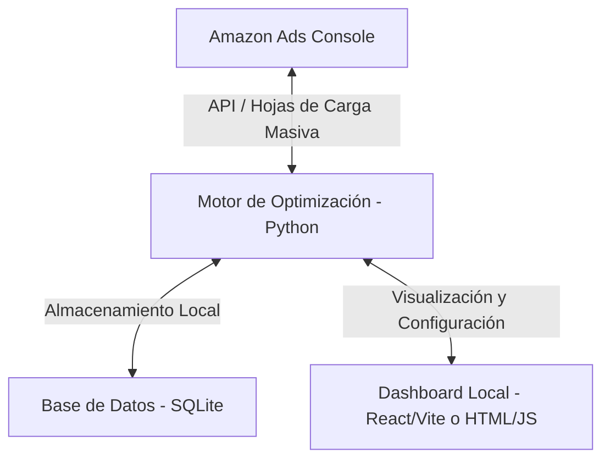

# Amazon Ads Optimization Engine (AAOE)

Este proyecto tiene como objetivo automatizar la gestión y optimización de campañas de Amazon Ads (Sponsored Products, Brands y Display) para incrementar ventas y controlar el ACOS (Advertising Cost of Sales) mediante integraciones de API y procesamiento de archivos Bulk Sheets.

## Arquitectura Propuesta

## Módulos Principales

1. **Gestor de Conexión (API / Archivos):**
   - Configuración segura de credenciales de Amazon Ads API (LWA Client ID, Client Secret, Refresh Token, Profile ID).
   - Módulo de carga alternativa para procesar reportes en Excel/CSV (Bulk Sheets y Search Term Reports).

2. **Motor de Decisiones (Algoritmos de Optimización):**
   - **Negativización Automática:** Identificación de términos con alto gasto y cero conversión.
   - **Ajuste de Pujas (Bids):** Fórmulas matemáticas basadas en Target ACOS y ratio de conversión para subir/bajar bids.
   - **Optimización de Presupuestos:** Transferencia de presupuesto de campañas deficientes a campañas con alto ROAS.

3. **Dashboard de Visualización:**
   - Panel interactivo para visualizar métricas (ACOS, ROAS, CTR, Conversión, Spend, Sales).
   - Historial de cambios realizados para mantener un control de versiones de las campañas.

## Primeros Pasos

1. Configurar este directorio (`/Users/estefanomacedo/.gemini/antigravity/scratch/amazon-ads-optimizer`) como el espacio de trabajo activo.
2. Definir las credenciales en un archivo `.env` o utilizar el flujo de carga de archivos Excel si aún no se cuenta con acceso a la API.
